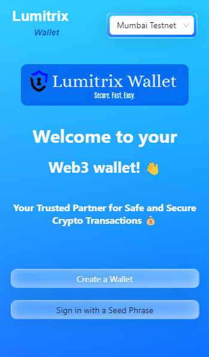
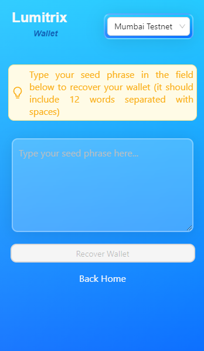
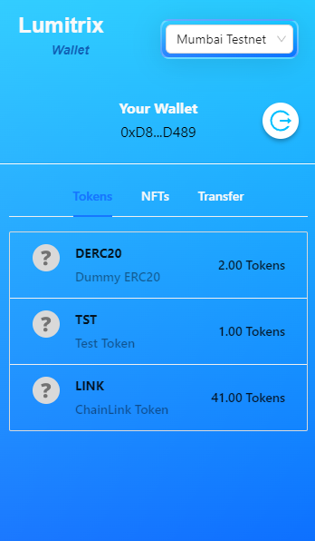
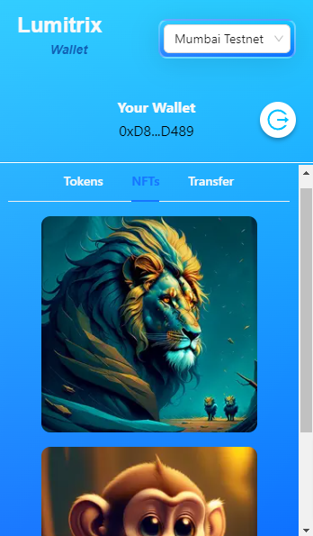
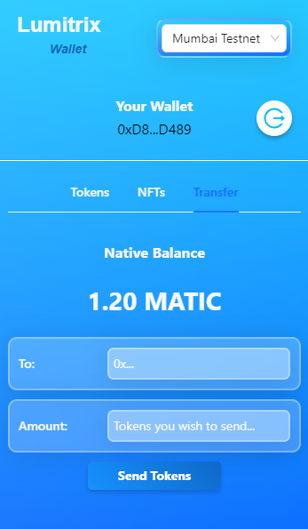

# ✨ Lumitrix-Wallet

Lumitrix Wallet is a `cryptocurrency` wallet browser extension that offers a seamless and secure way to manage your digital assets.

## 👀 About

Lumitrix Wallet is an wallet `extension` built using industry-leading technologies such as [ReactJS](https://react.dev/), [Express](https://expressjs.com/), and the modern design library [Ant Design](https://ant.design/).
It offers users a robust platform to securely manage their digital assets and perform token transfers between different wallet addresses.

## 👉 Technologies Used

- `Frontend`: The user interface is built using **ReactJS**, providing a responsive and intuitive user experience.
  Modern design libraries, such as Ant Design, are utilized to create a sleek and professional UI.

- `Backend`: The backend is implemented with Express, a fast and minimalist web framework for Node.js.
  It handles API requests, integrates with external services, and provides necessary server-side functionality.

- `Ethereum Interaction`: To interact with the Ethereum blockchain and perform blockchain operations,
  Lumitrix Wallet utilizes ethers.js, a powerful JavaScript library for working with Ethereum and Ethereum-compatible blockchains.

- `Blockchain Integration`: The wallet extension integrates with Alchemy and Moralis endpoints and API keys to connect with the Ethereum network, retrieve blockchain data, and execute transactions securely.

## 😍 Features

These are some of the features the wallet extension offers

- **Account Creation and Login:**
  Create a new wallet account and securely log in using a seed phrase for easy access to your funds.

<div align="center">
<<<<<<< HEAD
  <div style="display:flex;justify-content:space-evenly">
    
    
  </div>
</div>

- **Token Management:**
  Easily manage and monitor your token holdings, viewing token balances.

<div align="center">
  <div style="text-align: center;">
    
=======
  <div style="text-align: center;">
    
    &nbsp;&nbsp;&nbsp;&nbsp;
    
    &nbsp;&nbsp;&nbsp;&nbsp;
    
    <p>Create a new wallet account by generating a seed phrase by clicking the <strong>Generate Seed Phrase</strong> button and securely log in using the seed phrase for easy, secure and faster access to your funds.</p>
  </div>
</div>                       

### Token Management: 

<div align="center">
  <div style="text-align: center;">
    
    <p>Now you can easily manage and monitor your token holdings, by clicking on the <strong>Tokens</strong> tab you can view the different tokens associate with your account and their token balances.</p>
  </div>
</div>

### NFT Collection: 

<div align="center">
  <div style="text-align: center;">
    
    <p>You can explore and manage your non-fungible token (NFT) collection by clicking on the <strong>NFTs</strong> tab, it will display all the NFTs associate with your wallet address</p>
>>>>>>> 8f23e4c02e38b134ceaaf9354dc751b30956913f
  </div>
</div>

- **NFT Collection**

  You can explore and manage your non-fungible token (NFT) collection by clicking on the NFTs tab, it will display all the NFTs associate with your wallet address

<div align="center">
  <div style="text-align: center;">
<<<<<<< HEAD
    
=======
    
    <p>View the balance of your wallet address of the particular selected chain and Send tokens securely between wallets, ensuring the integrity and privacy of your transactions. With that you can not only transfer your tokens on just a single chain by clicking on the above top right corner's select dropdown you can select the preferable chain and transfer tokens on that chain</p>
>>>>>>> 8f23e4c02e38b134ceaaf9354dc751b30956913f
  </div>
</div>

- **Wallet Balance and Secure Transactions:**
  View the balance of your wallet address and Send tokens securely between wallets, ensuring the integrity and privacy of your transactions.

<div align="center">
  <div style="text-align: center;">
    
  </div>
</div>

## 👩‍🍳 Prerequisites

Before getting started make sure you have the following prerequisites installed on your system.

- [Google Chrome](https://www.google.com/chrome/) or [Mozila FireFox](https://www.mozilla.org/en-US/firefox/new/)

## 🏃 Installation

To install Lumitrix Browser Extension follow these steps

- Clone the repository or download the zip file.

```bash
  git clone https://github.com/aviroopjana/Lumitrix-Wallet.git
```

- Open your web browser (Google Chrome or Mozilla Firefox).

- Navigate to the browser's extension management page:

- Google Chrome: Click the menu icon (three dots) in the top-right corner, go to "More tools" > "Extensions."
  Mozilla Firefox: Click the menu icon (three horizontal lines) in the top-right corner, go to "Add-ons."
  Enable "Developer mode" or "Debug mode" in the extension management page.

- Click the "Load unpacked" or "Load temporary add-on" button and select the folder where you cloned or extracted the extension's source code.

- The Crypto Wallet Browser Extension should now be installed and visible in your browser's toolbar

## 🧑‍💼 Usage

To use the Crypto Wallet Browser Extension, follow these steps:

- Click on the extension icon in your browser's toolbar.

- If this is your first time using the extension, you will be prompted to create a new wallet or import an existing one. Follow the on-screen instructions to set up your wallet.

- Once your wallet is set up, you can view your wallet balance, send and receive transactions, and interact with supported dApps on various blockchain networks.

- Explore the extension's settings to customize your experience and manage your wallet preferences.

## 😁 Conclusion

This is a simple wallet browser extension. It provides a basic structure for users to get started with your crypto wallet browser extension, including installation instructions, usage guidelines, and information about contributing and support.
